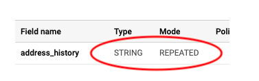
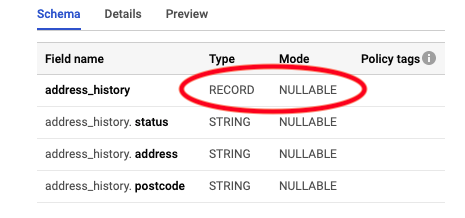
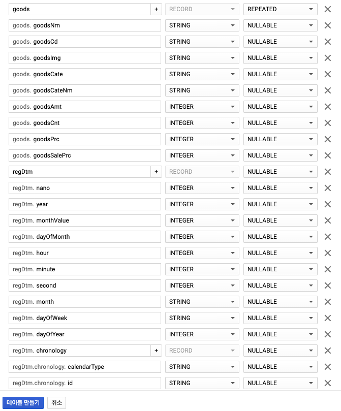
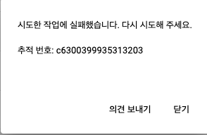

## Google BigQuery Schema 설계

### Array : []

리스트안에 string으로 이루어진 데이터 value 타입

```
id:”1",
name:”abc”,
age:”20",
address_history: [“current”, “previous”, “birth”]
```


#### BigQuery 스키마

여러개의 문자열들이 반복되어 이루어져 있으므로,

- Type: STRING

- Mode: REPEATED




### Struct: {}

딕셔너리 안에 여러개의 key-value 값들로 이루어진 데이터

```
id:”1",
name:”abc”,
age:”20",
address_history: {
“status”:”current”,
“address”:”London”,
“postcode”:”ABC123D”
}
```


#### BigQuery 스키마

Struct 타입은 RECORD로 표현할 수 있으므로,

- Type: RECORD

- Mode: NULLABLE

아래 하위 필드들에 포함 key 값들 추가하기




### Array of Structs

딕셔너리 안에 여러개의 딕셔너리가 리스트로 묶여져 있는 데이터 형태

```
id:”1",
name:”abc”,
age:”20",
address_history: [
{ “status”:”current”, “address”:”London”, “postcode”:”ABC123D” },
{ “status”:”previous”, “address”:”New Delhi”, “postcode”:”738497" },
{ “status”:”birth”, “address”:”New York”, “postcode”:”SHI747H” }
]
```


#### BigQuery 스키마

여러개의 Struct 타입들이 반복되어 이루어져 있으므로,

- Type: RECORD(Struct 타입에 쓰임)

- Mode: REPEATED

아래 하위 필드들에 포함 key 값들 추가하기




- Column 삭제 후 재추가

```
시도한 작업에 실패했습니다. 다시 시도해 주세요.

추적 번호: c6300399935313203
```




=> 테이블 삭제 후 새로 생성하기


ref.

> https://medium.com/google-cloud/how-to-work-with-array-and-structs-in-bigquery-9c0a2ea584a6

> https://cloud.google.com/bigquery/docs/nested-repeated?hl=ko#console


