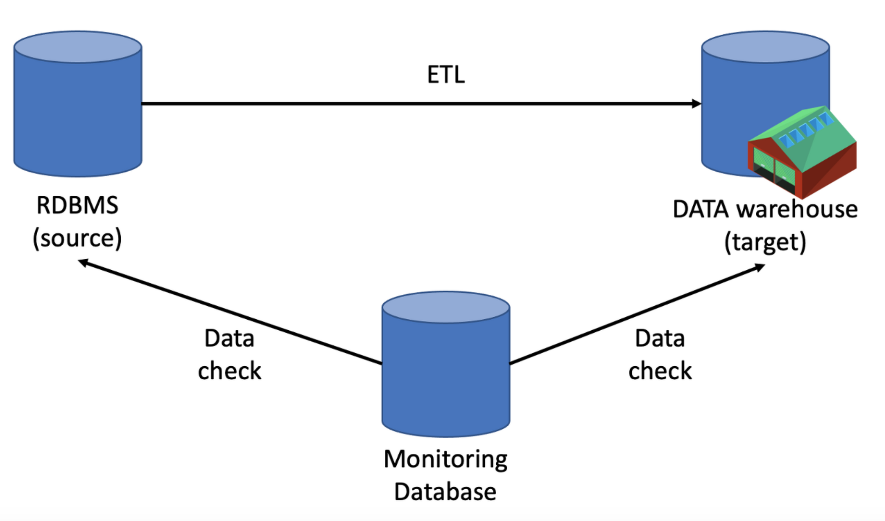

### 데이터 정합성

- 어떤 데이터들의 값이 서로 일치함

- 데이터가 서로 모순 없이 일관되게 일치해야 함을 의미 

- 데이터 정합성 검사는 분석의 시작
- 데이터의 오류(불일치)를 확인하고 해결하는 과정 => 정합성 검수


데이터를 적재하며 가장 중요한 것은 그 데이터가 정상적으로 잘 적재되었는지에 대한 여부입니다. 

많은 사람들이 어떻게 하면 적재를 '빠르고 효율적으로 적재할 수 있을지'에 대한 고민을 하지만, 정작 데이터가 정상적으로 A 👉🏻 B로 들어왔는지는 고민하지 않습니다.

데이터가 정확해야 분석가에게 정확한 수치를 제공할 수 있고, 이를 기반으로 정확한 의사판단의 기준을 가지고 의사결정을 내릴 수 있습니다. 데이터가 부정확할 경우, 데이터를 관리하고 이관하는 데이터엔지니어의 신뢰도가 떨어질 수 있습니다.


### 어떻게 체크할 것인가?



**모니터링 RDB에 쌓는 이유**

1. 데이터의 건수 체크 기능 및 시계열 추세 확인
2. 언제 얼마나 쌓였는지, 데이터의 증감률과 같은 history 데이터 확인 가능 
3. 데이터를 계속해서 시간/날짜 단위로 비교하여 여러가지 시각화 지표로 만들어 한 눈에 볼 수 있음


1. 데이터 건수 체크

   1. 데이터가 RDB에서 Data Warehouse로 잘 넘어왔는지 체크하기 위한 가장 단순하 확실한 방법
   2. 로그의 적재 시간 필요 -> RDB에 데이터가 입력된 시간(regDtm)
   3. 효율적인 건수 체크를 위해서는 RDB 시간 컬럼에 index를 만들어 부하를 줄일것
   4. 날짜 조건을 통해서 정확한 건수 체크를 위한 쿼리문:

   ```
   SELECT COUNT(*)
   FROM TABLE 
   WHERE CREATE_DATE >= '2021-06-01' AND CREATE_DATE < '2021-06-02'
   ```

   5. 날짜를 통해 정확히 가져왔기 때문에, 데이터 건수가 다를 경우 중복/누락을 의심해볼 수 있음
   6. 여기서 중요한 점은, 날짜를 정확히 끊어서 체킹할 것 -> 원천 테이블의 데이터는 계속 쌓이기 때문에

   

2. 데이터 중복 체크(unique key값 이용)

   1. 중복 체크를 통해 Data warehouse의 중복 뿐 아니라 RDB(원천테이블)의 데이터를 추가적으로 검증
   2. 유니크 컬럼을 통해 중복 체크 쿼리문

   ```
   SELECT id,COUNT(*) AS cnt
   FROM TABLE
   GROUP BY id
   HAVING count(*) > 1
   ```

   3. 퀴리 결과로 건수가 1개 이상일 경우 모니터링 RDB에 저장하고 slack alert를 걸어두기

      1. 중복으로 데이터 적재의 확인과 실시간 대응이 간능함

      

   4. 의문점: 전체 테이에서 건수를 가져오면 빅쿼리 비용이 많이 발생하지 않을까?

      

      1. 엄청나게 큰 비용 발생하지 않음
      2. 중복 체크의 경우 하루 1번정도 이루어짐
      3. 이로 인한 비용보다 체킹을 하지 않아 발생하는 비용이 더 큰 손실이 될수도 있음
