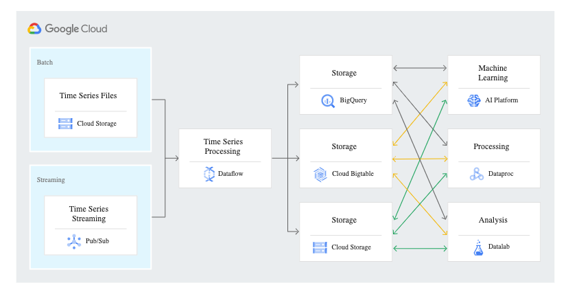
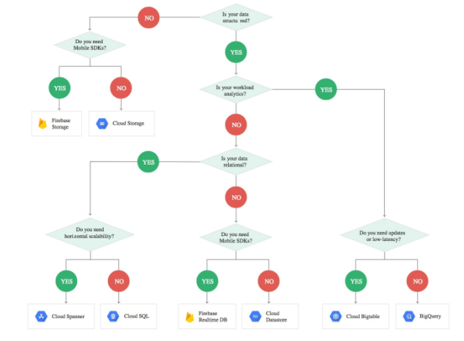
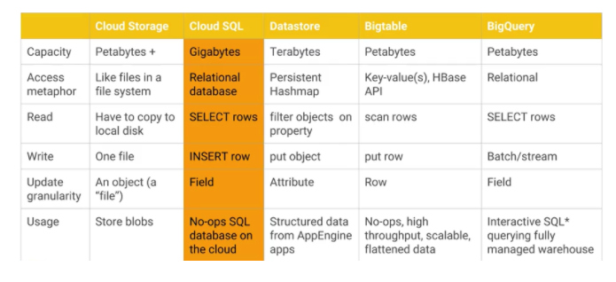
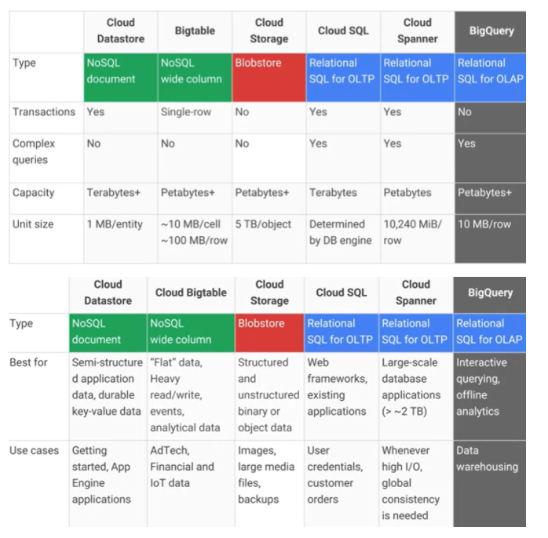

### RDBMS

- 하나의 테이블이 다른 테이블들과 관계를 맺고 모여있는 집합체
- 테이블 간 관계를 나타내기 위해 외래 키(foreign key) 사용
- 외래 키를 사용한 테이블 간 Join이 가능함

장점

- 정해진 스키마에 따른 데이터 저장으로 명확한 데이터 구조 보장
- 각 데이터를 중복 없이(데이터 무결성) 한 번만 저장할 수 있음

단점

- 성능 향상을 위해서는 서버의 성능 향상을 위한 Scale-Up만 지원 ⇒ 비용 증가
- 시스템이 커질 경우 JOIN문을 복잡한 쿼리로 만들어야 함
- 스키마로 인해 데이터가 유연하지 못함 ⇒ 스키마가 변경될 경우 번거로움

### NoSQL

- RDBMS와 달리 테이블 간 관계를 정의하지 않음 ⇒ 테이블 간 Joing 불가능
- 정확한 데이터 구조 알 수 없고, 데이터가 변경/확장의 가능성이 있는 경우 사용함
- RDBMS의 테이블과 같은 개념의 컬렉션이라는 형태로 데이터 관리

장점

- 유연하고 자유로운 데이터 구조 ⇒ 언제든 데이터 조정 및 새로운 필드 추가 가능
- 다양한 형태의 저장기술로 수평적 확장성(Scale-Out)을 쉽게 할 수 있는 장점

단점

- 데이터 중복의 발생
- 데이터 변경 시 모든 컬렉션에서 수행해야함
- 스키마 X ⇒ 명확한 데이터 구조 보장 X
- Key-Value Database
  - 데이터가 `Key`와 `Value`의 쌍으로 저장됨
  - `Key`는 `Value`(어떠한 형태의 데이터도 가능)에 접근하기 위한 용도로 사용
  - 요청과 응답 속도가 굉장히 빠른 편
  - ex) Redis, Riak, Dynamo DB
- Document Database
  - 데이터가 `Key`와 `Document`의 형태로 저장됨
  - Document는 Value가 계층적인 형태인 Document로 바로 저장됨
  - 검색에 최적화되어 있음
  - 응답 결과는 JSON/ XML 형태로 출력됨 ⇒  SQL과 쿼리가 다른점
  - ex) MongoDB
- Wide Column Database
  - Key는 Row(Value)와 Column-family, Column-name을 가진다
  - ex) HBase

`RDB`

## **Cloud SQL**

- (클라우드에서 완전) 관리형 MySQL, PostgreSQL, SQL Server
- 온프레미스에서 운영하는 SQL DB를 클라우드에 옮길 때 사용
- `백업`, `복제`, `용량 확장` 등 모두 자동화 및 `고가용성` 보장
- 연중무휴 신뢰, 안전한 서비스로 `비즈니스 연속성` 유지
- BigQuery와 손쉽게 통합

## **Cloud Spanner**

- `무제한 확장`: 원하는 크기와 규모로 시작 후 요구사항 증가 시 확장 ⇒ 10TB 이상 사용 시 권장
- `일관성`: 리전과 대륙에 걸쳐 고성능 트랜잭션 제공
- `고가용성`: 온라인 스키마 변경 없이, 다운타임 없이 사용
- 데이터베이스 유지보수 비용의 감소

## **BigQuery**

- `Data Warehouse` for large amounts of relational structed data to
  - ingest: 배치 처리, 실시간 스트리밍 처리
  - store: 표준 SQL 지원
  - analyze
  - visualize data
- `완전관리형`(fully managed), `서버리스`
- Pay-as-you-go 모델, storage와 computation 비용 분리
  - 장기간(90일 이상) 데이터 업데이트(read만 가능) 안하면 구글이 자동으로 Storage 비용 낮춰줌
- built-in Data Transfer Service로 온프레미스 data resource 이전(migrate) 가능
- Large-scale(petabyte-scale) storage, ad-hoc-SQL-based `analysis`/`reporting` large datasets
- analyze data from `BigTable`
- Bigtable은 database와 serving path로 사용, BigQuery는 분석용도로 사용함
- sums, averages, counts, groupings, 머신러닝 모델 생성 queries, 머신러닝 분석/예측
- BigQuery 사용법: https://www.sicara.ai/blog/convert-postgresql-bigquery-standard-sql

------

`Document`

## **Datastore**

- `자동(수평적)확장`, `고성능`, `간편 애플리케이션 개발` 위한 BigTable에 기반한 NoSQL DB

- 읽기/ 쓰기 고가용성: 장애 지점 영향 최소화하기 위한 중복화 사용

- 고성능의 방대한 확장성

  - 분산형 아키텍처 사용으로 확장 자동 관리
  - 대규모 데이터 세트 자동 확장으로 애플리케이션 유입 트래픽 양이 많아져도 고성능 유지

- 저장 데이터 암호화: 디스크 기록 전 모두 자동 암호화 후 승인된 사용자에게만 자동 복호화

- 다운타임 없는 완전 관리형

- 유연한 데이터 저장 및 쿼리: SQL과 유사한 

  GQL 쿼리 언어

   제공

  - SQL에서 허용되는 쿼리 유형보다 제한적
  - Join 작업, 불일치 필터링, 서브 쿼리 결과에 따른 데이터 필터링 지원 X

- `가용성`이 높은 `대규모의 구조화`된 데이터를 사용하는 애플리케이션에 이상적!

  - 실시간 재고 및 제품 세부정보 제공
  - [ACID](https://en.wikipedia.org/wiki/ACID) 속성 기반 트랜잭션(한 은행 계좌에서 다른 계좌로 이체하는 경우)

- But, 분석 데이터에 효과적이지 않음

  - OLTP(온라인 트랜잭션 처리) 시스템에 전체 SQL 지원 제공 RDB→ Cloud SQL
  - 데이터 구조화 수준 높지 않은 경우 → Bigtable
  - OLAP(온라인 분석 처리)를 위한 양방향 쿼리가 필요한 경우 → BigQuery

## **Firestore**

- Datastore의 최신버전
- NoSQL 문서 DB: 데이터를 문서 컬렉션으로 저장
- `모바일/웹/IOT APP` 고성능, 간편 애플리케이션 개발(`실시간 동기화` 및 `오프라인` 모드 기능 제공)
- 완전 관리형 서버리스 데이터베이스: 수요에 따른 자동 확장 및 축소
- `높은 가용성` 보장, 실시간 업데이트
- 사용한 만큼 지불하는 유연한 요금제
- Firebase보다 풍부하고 빠른 쿼리와 원활한 확장성 제공

## **Firebase 실시간 DB**

- "Firebase helps mobile app teams suceed"
- 실시간 동기화를 통해 웹/모바일에 손쉽게 data access하여 팀 공동작업 가능
- DB, Storage, Auth, Hosting, FA(Firebase Analytics), FCM(Firebase Cloud Messaging) 등 제공
- 훌륭한 서비스가 아닌 사용자에게 선보이고 평가 받는 것 목표로 할 때(소규모 스타트업)
- 서버 확장의 용이성(자동 진행)
- socket으로 연결되어 실시간 서비스 구축, (앱에서 하나의 DB를 보게 되므로) 데이터 저장/ 동기화가능
- 앱 개발 시 필요 도구/인프라 제공
- On-line Realtime(게시판 기능) JSON based NoSQL DB(서버 구조 미리 만들 필요X)

- 단점
  - 다중 column 검색 불가
  - 정렬 색인 따로 지정
  - 서버 구축보다 반응 속도 느림
  - 여러 조건으로 검색/ 빅데이터 저장하는 서비스라면 비추천

  

> https://hanburn.tistory.com/169

Firestore vs Firebase realtime DB

https://firebase.google.com/docs/database/rtdb-vs-firestore

------

`Key-Value`

## **Bigtable**

- NoSQL Wide-Column DB

- `대규모 읽기/쓰기` 처리량과 `low latency`(짧은 지연 시간)로 대용량 데이터에 대한 빠른 액세스 => 해당사항이 아니라면 `Firestore` 추천

- 초당 수천~수백만 건의 읽기쓰기 확장 가능

  - Downtime 없이 클러스터 크기(처리량) 동적 조정 가능 (노드 수 추가/제거)
  - 처리량 선형 확장으로 QPS(초당 쿼리 수) 늘릴 수 있음

- Real-Time Analysis of Large Datasets

- can store terabytes~petabytes of data

- raw 수정은 불가능(새로운 row 작성해야함)

- Based on HBase(HBase API 사용)

- `머신러닝`에 유용함: handle massive workloads

- `AdTech`/ `추천엔진`  /  `hyper-personalized marketing`

- BigQuery/ Apache 생태계 등 Google Cloud 서비스와의 연결이 간편함

- Google Analytics, Gmail에 사용됨

- 데이터를 쓰기하면 `자동 복제`를 수행하므로 `고가용성`과 격리 상태 관리가 용이함

- MapReduce-style operations에 적합하며, Hadoop, Dataflow, Dataproc과 잘 통합 된다

- 빠르고, 효율적이며, 비용이 저렴하다

  Financial analysis 활용 사례

**비용**

1. Bigtable 인스턴스 유형 및 인스턴스 클러스터 총 노드 수
   - 1시간마다 인스턴스 클러스터 내 최대 노드 수X시간 단위 요금
   - 노드 사용량에 관계 없이 프로비저닝 리소스 기준으로 책정 ⇒ 비활성화 상태도 요금 부과
   - $0.85/시간
2. 스토리지 용량(GB단위, 일 단위)
   1. SSD: $0.22/월
   2. HDD: $0.034/월
3. 네트워크 대역폭의 양(GB단위, 일 단위)

------

`InMemory`

## **Memorystore**

- 1mil/sec(밀리초) 미만 데이터 엑세스 제공 위한 완전 관리형 DB
- Redis, Memcached와 100% 호환
- `안전성`, `고가용성`, `확장성`, `완전관리형`
- 낮은 트랜잭션(처리) latency가 목적일 때 사용 추천
- 캐싱, 게임, 소셜 채팅, 뉴스 피드

**각 DB 비교**

**ref.**

- https://cloud.google.com/products/databases/
- https://towardsdatascience.com/how-to-choose-the-right-google-cloud-platform-database-a223f4d7482f
- https://afegbuaismaila.medium.com/choosing-the-right-google-cloud-platform-gcp-database-c517cfe0e593
