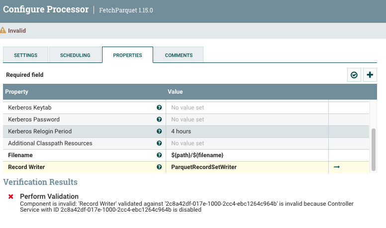
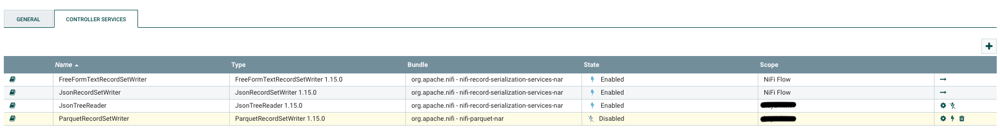
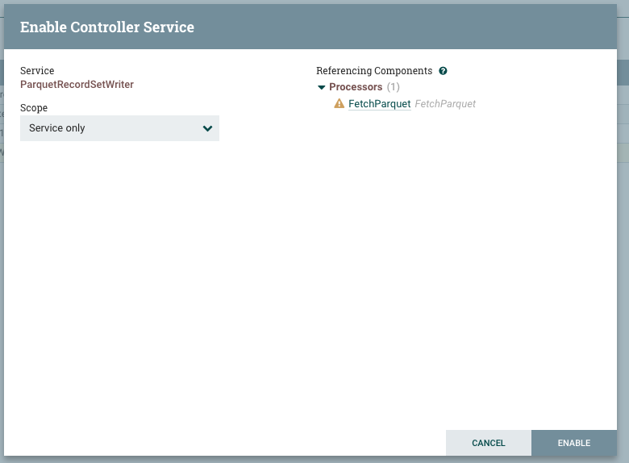
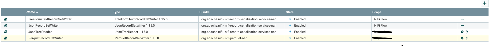

Nifi FetchParquet processor 사용 시 발생하는 에러

```
Component is invalid: 'Record Writer' validated against '2c8..' is invalid because Controller Service with ID 2c8.. is disabled
```


오른쪽 작은 화살표 클릭 > ENABLE 클릭





