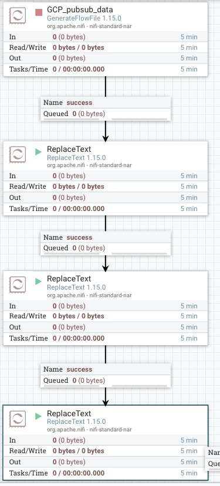
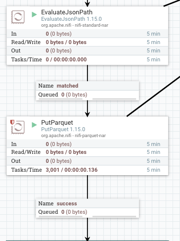
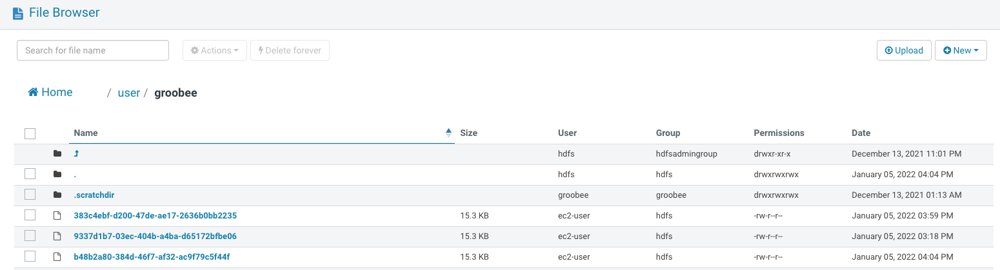
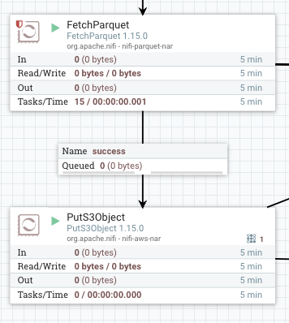

## Log 수집기 NiFi Setting


### input data

```json
{
	'newSession': 'True', 
	'serviceKey': '00af465e2959424d9f652bbd0ca5c9ad', 
	'cookieId': '1d0b37f2-5d4d-cb38-362e-f2653ee207e0', 
	'actionCd': 'DI', 
	'memberId': '', 
	'pageUrl': 'https://findkapoor.com/custom_project_3.html?utm_source=naver&utm_medium=castbox&utm_term=%EB%AF%B8%EB%8B%88%ED%95%91%EA%B3%A0%EB%A0%88%ED%84%B0%EB%A7%81%EB%B8%94%EB%9E%99&utm_campaign=main&NaPm=ct%3Dkw1ug7uo%7Cci%3Da5a6b1ebdd46e9cb00169481992c8624929eb21b%7Ctr%3Dsbtp%7Csn%3D423497%7Chk%3Ddcc00ac9a8e1f7450e2932b7036fd58fa4d7b637', 
	'referUrl': 'https://www.naver.com/', 
	'goods': None, 
	'searchKwd': None, 
	'browserCd': 'ED', 
	'browserLang': 'KO', 
	'regDtm': '2021-11-16T17:38:56.833198', 
	'deviceCd': 'PC', 
	'orderNo': None, 
	'sessionSeq': 2, 
	'userSeq': 2, 
	'sessionUserSeq': 1, 
	'userAgent': 'Mozilla/5.0 (Windows NT 10.0; Win64; x64) AppleWebKit/537.36 (KHTML, like Gecko) Chrome/95.0.4638.69 Safari/537.36 Edg/95.0.1020.53', 
	'userId': 'bd19a18f-cbc9-a1ba-67f8-edba3cc101b6', 
	'userIp': '112.165.104.190', 
	'queryString': '?utm_source=naver&utm_medium=castbox&utm_term=%EB%AF%B8%EB%8B%88%ED%95%91%EA%B3%A0%EB%A0%88%ED%84%B0%EB%A7%81%EB%B8%94%EB%9E%99&utm_campaign=main&NaPm=ct%3Dkw1ug7uo%7Cci%3Da5a6b1ebdd46e9cb00169481992c8624929eb21b%7Ctr%3Dsbtp%7Csn%3D423497%7Chk%3Ddcc00ac9a8e1f7450e2932b7036fd58fa4d7b637', 
	'stayTime': 0, 
	'campaignKey': 'CAe6f969b01b8d4ae6b3996ac53dd30240', 
	'msgType': 'A', 
	'campaignTypeCd': 'CA', 
	'algorithmCd': None, 
	'category': None, 
	'prevStayTime': 0, 
	'pubCmpMap': {
		'CAe6f969b01b8d4ae6b3996ac53dd30240': {
			'campaignKey': 'CAe6f969b01b8d4ae6b3996ac53dd30240', 
			'msgType': 'A', 
			'msgCd': None, 
			'campaignTypeCd': 'CA'
		}
	}, 
	'customData': {}, 
	'memberData': {}, 
	'trackingId': None, 
	'nextDU': None, 
	'nextDP': None, 
	'groobeeId': None, 
	'nextCmpObj': {}, 
	'experimentName': None, 
	'modelName': None, 
	'responseType': None, 
	'clickData': None, 
	'sendType': None, 
	'coupon': 'False'
}
```





**GCP_pub/sub_data(GetFlowFile)**

Custom text data input 설정


**Replace Text 데이터 처리 부분**

1. 모든 string single quote → double quote
2. None → “” 빈 스트링 처리
3. {} → “” 빈 스트링 처리

return value:

```
[
  {
    "newSession": "True",
    "serviceKey": "00af465e2959424d9f652bbd0ca5c9ad",
    "cookieId": "1d0b37f2-5d4d-cb38-362e-f2653ee207e0",
    "actionCd": "DI",
    "memberId": "",
    "pageUrl": "https://findkapoor.com/custom_project_3.html?utm_source=naver&utm_medium=castbox&utm_term=%EB%AF%B8%EB%8B%88%ED%95%91%EA%B3%A0%EB%A0%88%ED%84%B0%EB%A7%81%EB%B8%94%EB%9E%99&utm_campaign=main&NaPm=ct%3Dkw1ug7uo%7Cci%3Da5a6b1ebdd46e9cb00169481992c8624929eb21b%7Ctr%3Dsbtp%7Csn%3D423497%7Chk%3Ddcc00ac9a8e1f7450e2932b7036fd58fa4d7b637",
    "referUrl": "https://www.naver.com/",
    "goods": "",
    "searchKwd": "",
    "browserCd": "ED",
    "browserLang": "KO",
    "regDtm": "2021-11-16T17:38:56.833198",
    "deviceCd": "PC",
    "orderNo": "",
    "sessionSeq": 2,
    "userSeq": 2,
    "sessionUserSeq": 1,
    "userAgent": "Mozilla/5.0 (Windows NT 10.0; Win64; x64) AppleWebKit/537.36 (KHTML, like Gecko) Chrome/95.0.4638.69 Safari/537.36 Edg/95.0.1020.53",
    "userId": "bd19a18f-cbc9-a1ba-67f8-edba3cc101b6",
    "userIp": "112.165.104.190",
    "queryString": "?utm_source=naver&utm_medium=castbox&utm_term=%EB%AF%B8%EB%8B%88%ED%95%91%EA%B3%A0%EB%A0%88%ED%84%B0%EB%A7%81%EB%B8%94%EB%9E%99&utm_campaign=main&NaPm=ct%3Dkw1ug7uo%7Cci%3Da5a6b1ebdd46e9cb00169481992c8624929eb21b%7Ctr%3Dsbtp%7Csn%3D423497%7Chk%3Ddcc00ac9a8e1f7450e2932b7036fd58fa4d7b637",
    "stayTime": 0,
    "campaignKey": "CAe6f969b01b8d4ae6b3996ac53dd30240",
    "msgType": "A",
    "campaignTypeCd": "CA",
    "algorithmCd": "",
    "category": "",
    "prevStayTime": 0,
    "pubCmpMap": {
      "CAe6f969b01b8d4ae6b3996ac53dd30240": {
        "campaignKey": "CAe6f969b01b8d4ae6b3996ac53dd30240",
        "msgType": "A",
        "msgCd": "",
        "campaignTypeCd": "CA"
      }
    },
    "customData": {},
    "memberData": {},
    "trackingId": "",
    "nextDU": "",
    "nextDP": "",
    "groobeeId": "",
    "nextCmpObj": {},
    "experimentName": "",
    "modelName": "",
    "responseType": "",
    "clickData": "",
    "sendType": "",
    "coupon": "False"
  }
]
```




**EvaluateJsonPath**

Json data의 Key, Value 형태로 변수 추출하기

**PutParquet**

Json data → Parquet file 형식으로 변환하여 HDFS /user/groobee 경로에 저장하기







**FetchParquet**

이전 프로세스에서 HDFS에 올려놓은 Parquet 파일을 가져와서 Parquet으로 레코드 쓰기 설정

**PutS3Object**

S3 버킷 경로 설정 후 parquet 파일 저장

